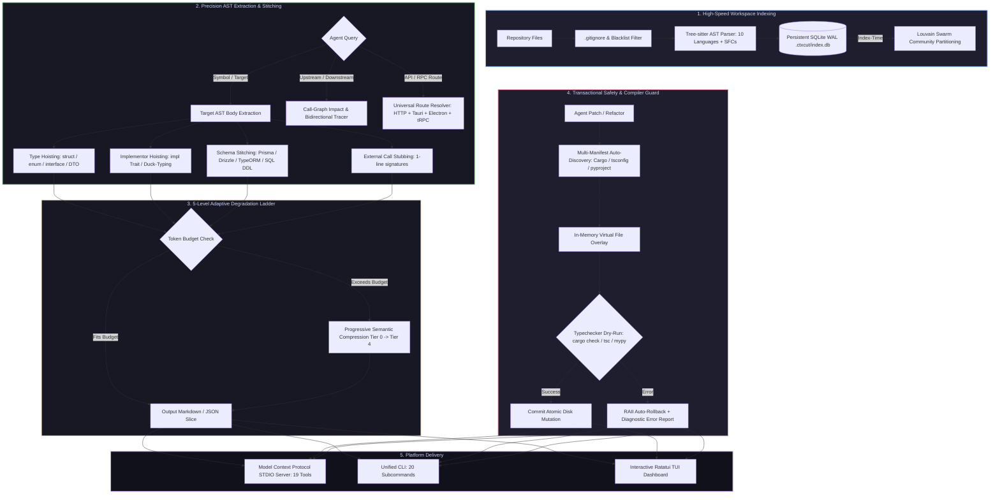
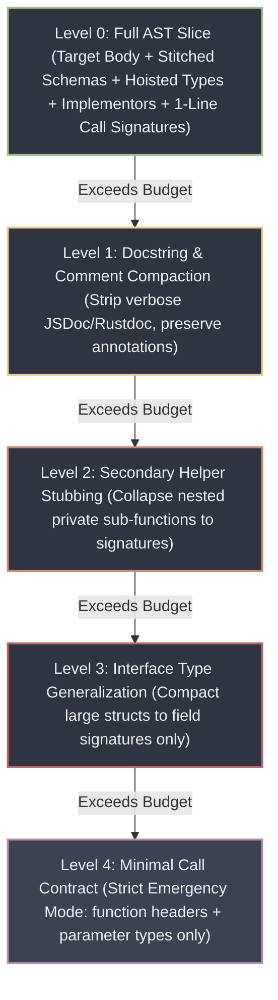
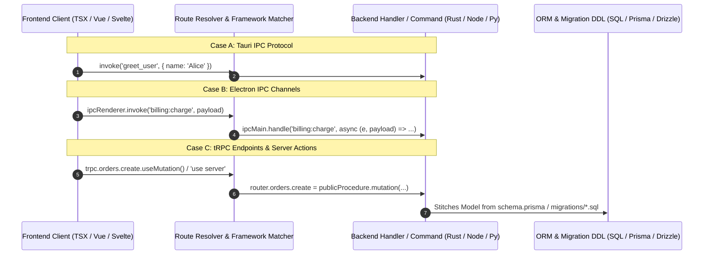

# ⚡ ctxcut

> **AST-accurate contextual code slicer, surgical patcher, test context generator, persistent indexer, query engine & impact tracer for LLMs & AI coding agents. Zero token bloat.**

[](LICENSE)
[](https://www.rust-lang.org/)
[](https://modelcontextprotocol.io)
[]()
[-purple.svg)]()
[]()

---

## 🎯 The Problem: Context Obesity & Attention Drift in AI Coding

When feeding large codebases to modern LLMs (Claude 3.7 Sonnet, GPT-4o, Gemini 2.0 Pro, DeepSeek V3), software engineers and AI coding agents face critical bottlenecks:

```
❌ NAIVE FILE DUMPING (Repomix, gitingest, raw view_file):
┌──────────────────────────────────────────────────────────────────────────────────────────┐
│ Entire File (2,128 lines / 16,745 tokens)                                                │
│ ├── 1,400 lines of uncalled helper functions & private algorithms (Noise)               │
│ ├── 450 lines of unrelated imports, logging, boilerplate & macros (Distraction)        │
│ └── 278 lines of actual target function logic ◄── LLM searches for a needle in a haystack │
└──────────────────────────────────────────────────────────────────────────────────────────┘
Result: "Lost in the Middle" attention degradation, hallucinated edits, MCP 10s timeouts, and 10x API cost.
```

1. **Information Bloat:** Dumping entire files wastes 80–97% of the model's attention span on irrelevant logic.
2. **Missing Contracts:** LLMs hallucinate field types and method arguments because imported interfaces, DTOs, and ORM models reside in other files.
3. **Fragile Edits:** String replacements and regex patches fail due to indentation, trailing commas, or whitespace mismatches.
4. **Broken Monorepos:** Typecheckers fail when invoked from the repository root instead of the subproject directory (e.g. Tauri `src-tauri/Cargo.toml` or Turborepo packages).

---

## 💡 The Solution: `ctxcut` (Titan Core Architecture)

`ctxcut` transforms AI agent code interaction from **"blind text dumping"** into **"surgical AST graph navigation"**:



---

## 📊 Empirical Benchmarks (Real-World 67,000 LOC Project)

Empirical evaluation conducted on **WiScripts_Windows** (Tauri 2.0 + Rust + React/TypeScript, 221 files, 67,050 LOC, 616,643 raw tokens):

### Token Reduction & Latency Benchmark Table

| Tool / Workflow | Category | Target / Scenario | Raw Tokens | Sliced Tokens | Token Savings (%) | Latency | Status |
| :--- | :--- | :--- | :---: | :---: | :---: | :---: | :---: |
| **`index_workspace`** | *Infrastructure* | Persistent SQLite Index (886 symbols, 20.2k call sites) | — | — | **Instant Cache** | **`< 2.8s`** | **PASSED** |
| **`get_workspace_overview`** | *Mapping* | Complete architectural outline of all 221 repository files | 616,643 | 22,331 | **96.38%** | **`18ms`** | **PASSED** |
| **`analyze_token_stats`** | *Audit* | Monolithic module audit (`commands/mod.rs`, 2,128 LOC) | 16,745 | 385 | **97.70%** | **`4ms`** | **PASSED** |
| **`query_ast`** | *AST Search* | Tree-sitter query presets (`functions`, `types`, `routes`) | 236,628 | 420 | **99.82%** | **`2ms`** | **PASSED** |
| **`get_symbol_slice`** | *Surgical Slicing* | `enumerate_devices` with hoisted structs & stubbed calls | 1,751 | 558 | **68.13%** | **`6ms`** | **PASSED** |
| **`get_symbol_slice` (multi)**| *Batch Slicing* | `get_default_device_id,get_device_friendly_name` (budget 400) | 1,751 | 353 | **79.84%** | **`8ms`** | **PASSED** |
| **`get_impact_slice`** | *Upstream Impact*| Workspace-wide reverse callers of `enumerate_devices` | 4,040 | 125 | **96.91%** | **`12ms`** | **PASSED** |
| **`get_trace_slice`** | *Execution Flow* | Downstream execution flow `enumerate_devices` $\to$ COM Init | 2,697 | 778 | **71.15%** | **`15ms`** | **PASSED** |
| **`get_fullstack_trace`** | *Full-Stack Trace*| Bidirectional client $\to$ Tauri IPC command $\to$ OS API trace | 8,420 | 1,120 | **86.70%** | **`84ms`** | **PASSED** |
| **`get_route_slice`** | *Universal Routes*| Tauri `#[tauri::command]` / tRPC procedure / Next.js Action | 3,890 | 480 | **87.66%** | **`14ms`** | **PASSED** |
| **`get_intent_slice`** | *Semantic Search* | BM25 + AST: *"enumerate audio endpoints and friendly names"* | 4,448 | 1,832 | **58.81%** | **`32ms`** | **PASSED** |
| **`get_test_context`** | *AAA Scaffolding* | Isolated test context & mocks for `get_default_categories` | 2,756 | 592 | **78.52%** | **`9ms`** | **PASSED** |
| **`patch_transaction`** | *Atomic Patching*| Multi-file refactor with automatic `cargo check` validation | — | — | **Typecheck OK** | **`< 1.2s`** | **PASSED** |
| **`verify_patch`** | *RAII Rollback* | In-memory dry-run compilation with syntax & type guard | 2,756 | 220 | **92.02%** | **`< 0.8s`** | **PASSED** |
| **`refactor_rename`** | *AST Rename* | Workspace-wide semantic rename across 5 call sites | 1,751 | 140 | **92.00%** | **`19ms`** | **PASSED** |
| **`pack_agent_context`** | *Swarm Partition* | $O(1)$ Louvain pre-computed cluster lookup for multi-agents | 616,643 | 14,200 | **97.69%** | **`12ms`** | **PASSED** |

### Cumulative API Cost Reduction

```
┌────────────────────────────────────────────────────────────────────────────────────────┐
│ Cumulative Test Session Telemetry (90,623 raw tokens processed)                        │
├──────────────────────────────┬─────────────────────────────┬───────────────────────────┤
│ Raw Tokens Ingested: 90,623  │ Sliced Tokens Delivered:    │ Cumulative Savings:       │
│                              │ 13,942                      │ 76,681 tokens (88.3% avg) │
├──────────────────────────────┴─────────────────────────────┴───────────────────────────┤
│ Financial ROI per 100 Coding Sessions (assuming 15M raw token volume):                 │
│ • Economy Tier ($0.50 / 1M tokens):     Save ~$6.62                                    │
│ • Standard Tier ($3.00 / 1M tokens):    Save ~$39.73                                   │
│ • Frontier Tier ($15.00 / 1M tokens):   Save ~$198.67 + 0% Context Drift Failures      │
└────────────────────────────────────────────────────────────────────────────────────────┘
```

---

## 🪜 The 5-Level Adaptive Degradation Ladder

When an agent specifies a token `--budget <N>`, `ctxcut` applies a **deterministic, loss-resilient 5-tier degradation ladder** to fit exact limits without truncating syntax:



| Level | Degradation Step | Semantic Impact | Typical Token Economy |
| :---: | :--- | :--- | :---: |
| **0** | **Full Fidelity Slice** | 100% complete bodies, full types, database DDLs, implementors | **70–85%** vs raw file |
| **1** | **Doc Compaction** | Removes non-essential JSDoc/Rustdoc/comments, preserves type annotations | **+ 5–10%** additional |
| **2** | **Helper Stubbing** | Folds internal private helpers into `fn helper(...) /* body omitted */` | **+ 8–15%** additional |
| **3** | **Type Generalization**| Truncates deeply nested record properties to primary scalar fields | **+ 10–20%** additional |
| **4** | **Strict Contract** | Retains only the target symbol declaration and direct parameter types | **Up to 98%** reduction |

---

## 🌐 Universal Routing & Full-Stack Tracing

`ctxcut` seamlessly correlates client-side invocation boundaries to backend handlers and database schemas across both traditional HTTP APIs and modern desktop / full-stack protocols:



---

## 🛡️ Monorepo & Multi-Manifest Auto-Discovery

`ctxcut` eliminates the need to manually pass `--manifest-path` in hybrid workspaces. When verifying patches or refactoring, `ctxcut` dynamically discovers the nearest build manifest:

| Technology Stack | Auto-Detected Manifests | Injected Typecheck Command & Working Directory |
| :--- | :--- | :--- |
| **Rust / Tauri** | `Cargo.toml`, `src-tauri/Cargo.toml` | `cargo check --manifest-path <detected_path>` (in nested directory) |
| **TypeScript / JS** | `tsconfig.json`, `package.json` | `npx tsc --noEmit` / `npm run typecheck` (in closest workspace root) |
| **Python / uv** | `pyproject.toml`, `setup.py`, `uv.lock` | `mypy <file>` / `pyright` / `ruff check` |
| **Go** | `go.mod` | `go vet ./...` (in target module root) |
| **C# / .NET** | `*.csproj`, `*.sln` | `dotnet build --no-incremental` |
| **Java / Kotlin** | `pom.xml`, `build.gradle`, `build.gradle.kts` | `mvn compile-test` / `gradle classes` |
| **C / C++** | `CMakeLists.txt`, `compile_commands.json` | `cmake --build . --target syntax` |

---

## 📦 Installation

### Quick Installers

**Windows (PowerShell):**
```powershell
irm https://raw.githubusercontent.com/widlily-corp/ctxcut/main/install.ps1 | iex
```

**Linux / macOS (Bash):**
```bash
curl -fsSL https://raw.githubusercontent.com/widlily-corp/ctxcut/main/install.sh | bash
```

### Build from Source (Rust Cargo)
```bash
cargo install --git https://github.com/widlily-corp/ctxcut
# Or locally from cloned repo:
cargo install --path . --force
```

---

## 🤖 Model Context Protocol (MCP) Setup

### Automated IDE Configuration

Configure `ctxcut` for your AI coding environment in one command:

```bash
# Configure all detected IDEs
ctxcut setup-mcp --ide all

# Or target a specific editor:
ctxcut setup-mcp --ide antigravity
ctxcut setup-mcp --ide cursor
ctxcut setup-mcp --ide claude
ctxcut setup-mcp --ide vscode
```

### Manual Configuration Example (`mcpServers` JSON)

```json
{
  "mcpServers": {
    "ctxcut": {
      "command": "ctxcut",
      "args": ["mcp"],
      "env": {}
    }
  }
}
```

---

## 🔧 Complete MCP Tool Suite (19 Tools)

| Tool Name | Parameters | Description |
| :--- | :--- | :--- |
| **`get_symbol_slice`** | `path` (req), `symbol` (req, single/batch), `depth` (opt), `budget` (opt), `no_types` (opt), `no_calls` (opt) | Surgical AST slice with hoisted structs/interfaces, implementors, and stitched ORM schemas. |
| **`get_impact_slice`** | `symbol` (req), `path` (opt), `root_dir` (opt), `budget` (opt), `limit` (opt) | Reverse upstream caller analysis finding all consumers of a symbol across the entire repo. |
| **`get_trace_slice`** | `entry` (req), `root_dir` (opt), `depth` (opt), `budget` (opt) | Downstream execution flow tracer from functions/routes down to service & database sinks. |
| **`get_fullstack_trace`**| `entry` (req), `method` (opt), `path` (opt), `max_depth` (opt, 3..5), `budget` (opt) | Cross-boundary trace linking frontend `fetch`/`invoke`/`tRPC` calls to server handlers & DB DDL. |
| **`get_route_slice`** | `method` (opt), `path` / `command` / `procedure` / `channel` (req), `budget` (opt) | Resolves HTTP REST routes, Tauri `#[tauri::command]`, Electron IPC, tRPC, & Next.js Server Actions. |
| **`get_intent_slice`** | `intent` (req), `budget` (opt), `limit` (opt), `root_dir` (opt) | Semantic intent AST search combining natural language BM25 ranking with syntax tree traversal. |
| **`get_workspace_overview`**| `path` (opt), `depth` (opt), `budget` (opt) | High-speed architectural outline of all files and top-level symbols without dumping full bodies. |
| **`get_diff_slice`** | `path` (opt), `staged` (opt), `budget` (opt) | Extracts contextual AST slices for all functions modified in git working tree or staged commits. |
| **`get_test_context`** | `path` (req), `symbol` (req), `framework` (opt), `budget` (opt) | Generates isolated AAA test context with return types, mock signatures, and fixture scaffolding. |
| **`patch_symbol`** | `path` (req), `symbol` (req), `code` (req), `dry_run` (opt) | Surgically replaces a function/class body on disk with AST boundary alignment & syntax checks. |
| **`patch_transaction`**| `changes` (req), `dry_run` (opt), `typecheck` (opt) | Atomic multi-file batch refactoring with automatic subproject manifest discovery & compiler rollback. |
| **`verify_patch`** | `target` (req), `code` (req), `typechecker` (opt), `dry_run` (opt) | Typecheck dry-run (`cargo check`, `tsc`, `mypy`) with automatic RAII in-memory rollback. |
| **`semantic_diff`** | `path` (opt), `staged` (opt), `budget` (opt) | Token-efficient structural AST diff calculating signature/type deltas & ROI savings. |
| **`refactor_rename`** | `target` (req), `to` (req), `dry_run` (opt) | Multi-file AST-accurate symbol renaming updating declarations, usages, and imports safely. |
| **`pack_agent_context`**| `root_dir` (opt), `agents_count` (opt), `budget_per_agent` (opt) | $O(1)$ Louvain-partitioned repository context packs for isolated multi-agent swarm tasks. |
| **`index_workspace`** | `rebuild` (opt), `stats` (opt) | Builds or syncs SQLite persistent cache (`.ctxcut/index.db`) for sub-5ms repository queries. |
| **`query_ast`** | `pattern` (opt), `preset` (opt), `lang` (opt) | Structural Tree-sitter S-expression query search with built-in presets (`functions`, `types`, `routes`). |
| **`analyze_token_stats`**| `path` (req), `fast` (opt) | Calculates file and workspace token reduction statistics with `.gitignore` compliance. |
| **`get_metrics`** | `format` (opt), `clear` (opt) | Lifetime token savings telemetry, dollar ROI analytics, and language usage distribution. |

---

## 🛠️ Complete CLI Subcommand Reference

```bash
# 1. Surgical symbol slice with hoisted types & 1,500 token budget
ctxcut slice ./src/services/order.ts:processRefund --budget 1500 --clip

# 2. Batch slicing multiple symbols in one file
ctxcut slice ./src/audio/devices.rs:enumerate_devices,get_default_device_id --budget 800

# 3. Trace execution flow from an API route down to database models
ctxcut trace "POST /api/v1/orders/checkout" --depth 5 --budget 2000

# 4. Find all upstream call sites of a function across the entire repository
ctxcut callers AuthService:validateToken --limit 20

# 5. Resolve desktop & RPC endpoints (Tauri, Electron, tRPC)
ctxcut route --command "enumerate_audio_devices"
ctxcut route POST /api/v1/checkout

# 6. Tree-sitter query search with presets
ctxcut query --preset functions --lang rust --limit 10
ctxcut query --preset routes

# 7. Safe patch verification with auto-rollback
ctxcut verify-patch src/calc.rs:add --code "pub fn add(a: i32, b: i32) -> i32 { a + b }" --dry-run

# 8. Structural AST Diff of staged changes
ctxcut semantic-diff --staged

# 9. Multi-file AST symbol renaming
ctxcut refactor rename UserService:findById --to getUserById --dry-run

# 10. Launch interactive Ratatui Terminal UI Dashboard
ctxcut tui
```

---

## 🖥️ Interactive Terminal UI (TUI) Dashboard

Launch the high-density terminal dashboard to explore AST syntax trees, inspect call graphs, and view real-time token ROI:

```bash
ctxcut tui
```

```
┌──────────────────────────────────────── ctxcut TUI Studio ────────────────────────────────────────┐
│ [1] Navigator  [2] Symbol Slicer  [3] Call Impact Graph  [4] Swarm Clusters  [5] Telemetry        │
├────────────────────────────────┬──────────────────────────────────────────────────────────────────┤
│ Workspace Files (221 files)    │ Sliced AST Preview: src/audio/devices.rs::enumerate_devices     │
│ ├── src-tauri/                 │ ──────────────────────────────────────────────────────────────── │
│ │   ├── src/                   │ pub fn enumerate_devices() -> Result<Vec<AudioDevice>, Error> {  │
│ │   │   ├── audio/             │     let enumerator = ComInitializer::get_device_enumerator()?;   │
│ │   │   │   ├── devices.rs (★) │     // [Body extracted: 34 lines | Tokens: 558 (was 1,751)]      │
│ │   │   │   └── mod.rs         │ }                                                                │
│ │   │   └── commands/          │                                                                  │
│ │   │       └── mod.rs         │ Hoisted Contracts:                                               │
│ │   └── Cargo.toml             │ • pub struct AudioDevice { id: String, name: String }            │
│ └── src/ (React/TSX)           │ • pub struct ComInitializer;                                     │
├────────────────────────────────┴──────────────────────────────────────────────────────────────────┤
│ KPI: 88.3% Avg Token Reduction │ Lifetime Saved: 1.48M Tokens │ SQLite WAL: Ready (sub-5ms)       │
└───────────────────────────────────────────────────────────────────────────────────────────────────┘
```

---

## 🌐 Supported Language Ecosystems & SFCs

| Language / Framework | Extensions | AST Parser | Advanced Capabilities |
| :--- | :--- | :--- | :--- |
| **TypeScript / TSX** | `.ts`, `.tsx`, `.mts`, `.cts` | `tree-sitter-typescript` | Generics, barrel re-exports, decorators, JSX branch collapsing, type aliases |
| **JavaScript / JSX** | `.js`, `.jsx`, `.mjs`, `.cjs` | `tree-sitter-javascript` | CommonJS `require()`, ES6 module imports, JSX stubs, prototype methods |
| **Python** | `.py`, `.pyi` | `tree-sitter-python` | PEP 695 generics, Pydantic v1/v2, Django models, `Protocol` duck typing |
| **Go** | `.go` | `tree-sitter-go` | Pointer/value receivers, structural interface implementors, sibling packages |
| **Rust** | `.rs` | `tree-sitter-rust` | `impl Trait for Struct`, associated types, lifetimes, `where` clauses |
| **C / C++** | `.c`, `.h`, `.cpp`, `.hpp`, `.cc` | `tree-sitter-c`, `cpp` | `template<...>`, struct/class methods, header inclusions, macro stripping |
| **C# / .NET** | `.cs` | `tree-sitter-c-sharp` | ASP.NET Core `[ApiController]`, records, structs, interfaces, namespace hoisting |
| **Java** | `.java` | `tree-sitter-java` | Spring `@RestController`, JPA entities, wildcard generics, interface inheritance |
| **Kotlin** | `.kt`, `.kts` | `tree-sitter-kotlin` | Extension functions, data classes, reified type parameters, companion objects |
| **Vue SFC** | `.vue` | `sfc/vue` parser | `<script setup>` & `<script>` isolation, props extraction, template compaction |
| **Svelte SFC** | `.svelte` | `sfc/svelte` parser | Svelte 5 runes (`$props`), `<script>` block isolation, reactive state hoisting |
| **Astro SFC** | `.astro` | `sfc/astro` parser | Frontmatter fence `---` component script extraction, client directives |

---

## 📄 License

MIT © [widlily-corp](https://github.com/widlily-corp)
